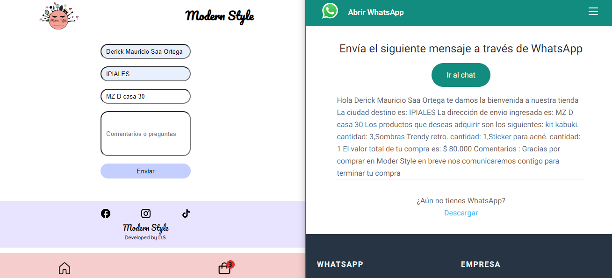

## <h1 align='center'>Make Up page</h1>

 

## Descripción del proyecto 

Consiste en el desarrollo de una app en línea que será una tienda virtual. La tienda desarrollada cuenta con dos categorías de productos, una de maquillaje y una de cuidado para la piel. las cuales se encuentran en la sección tienda de la app. La tienda cuenta con un carrito de compras el cual permite añadir los productos que deseas comprar, aumentarlos en cantidad y eliminarlos si ya no los deseas. al final de la página encuentras un formulario en el cual diligencias la información de envío de los productos. seguido de esto la información del carrito de compras se añade automáticamente a un mensaje de whatsapp que será enviado junto con la información de envío que diligencies en un formulario al que se te redirige luego de dar click en el botón de finalizar compra.  

## Indice

*[ Título e imagen de portada](#make-up-page)\
*[Descripción del proyecto ](#descripción-del-proyecto)\
*[ Estado del proyecto](#estado-del-proyecto)\
*[ Tecnologías utilizadas](#tecnologías-utilizadas)\
*[Acceso al proyecto](#acceso-al-proyecto)\
*[Características y funcionalidades](#características-y-funcionalidades)

## Estado del proyecto

El proyecto se encuentra finalizado, al menos para cumplir las especificaciones del desarrollo del proyecto final de REACT. Con algunos detalles a perfeccionar. en un futuro sería interesante automatizar aún más el proceso de compra con una pasarela de pago PSE. 

## Tecnologías utilizadas 

Toda la aplicación es desarrollada en react, dando estilos a cada uno de los componentes con CSS. El despliegue se realiza en vercel 

## Acceso al proyecto. 

El proyecto se encuentra desplegado en vercel. Puedes verlo dando click [aquí](https://modern-style.vercel.app/)

## Características y funcionalidades

- `Agregar única vez al carrito` : Solo se puede agregar un sólo producto al carrito desde la tienda, la cantidad del mismo se podrá aumentar una vez se encuentre en el carrito de compras. Si el producto llega a cero en el carrito de compras este desaparecerá automáticamente del carrito.  

- `Índice de productos agregados al carrito `: Una vez se agrega un producto al carrito aparecerá un índice en un círculo rojo en la parte superior izquierda del icono de compras. 

- `Envío del mensaje de pedido por whatsapp  `: Una vez que el cliente esté satisfecho con su pedido la app escribe automáticamente un mensaje con el pedido y la información de envío para ser redirigido a enviar en la cuenta de whatsapp de la tienda 

